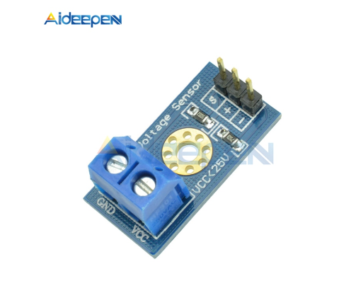

# Пожарно-охранная система

Используется извещатель пожарный дымовой оптикоэлектронный ИП 212-131М. 

Схема подключения приложена к данному пояснению.

Блок питания 12 В. питает напрямую датчик **(провода: зеленый (+), белый (-))**, по обратной ветке подключено
к сенсору напряжения (делитель напряжения) **(провода: красный (+), синий (-))**  

https://aliexpress.ru/item/4000133054727.html?spm=a2g2w.orderdetails.0.0.7bbc4aa6dJpSt2&sku_id=10000000396368117

